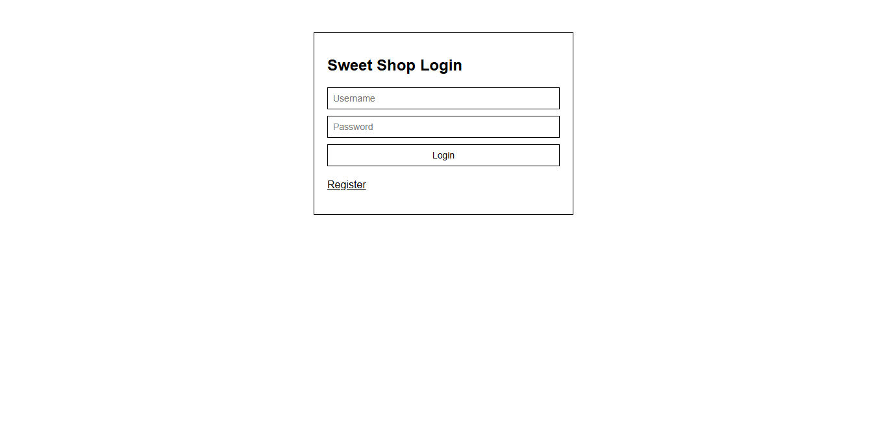
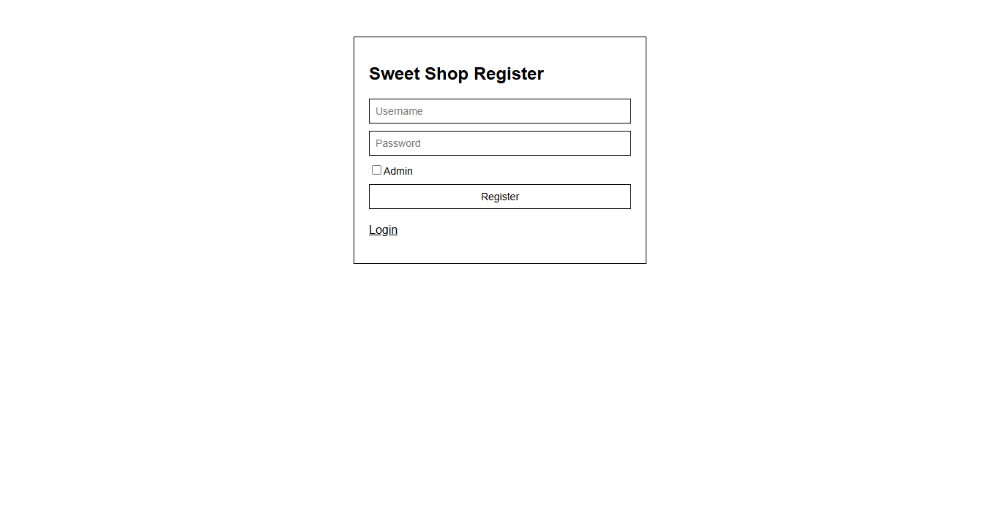
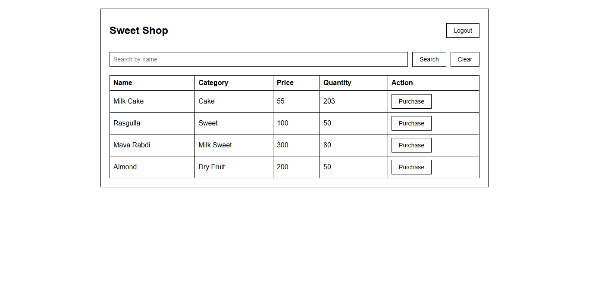
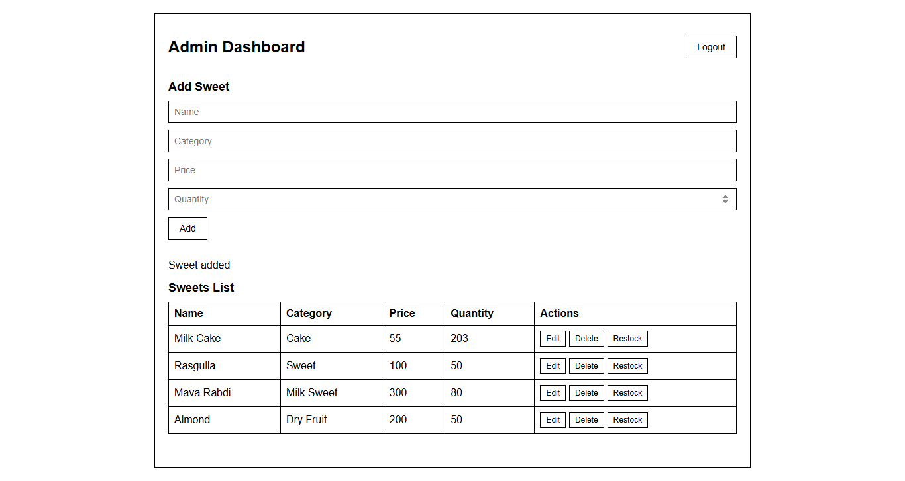
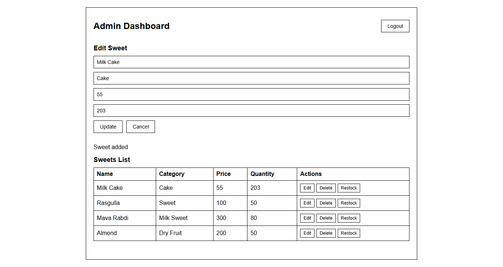
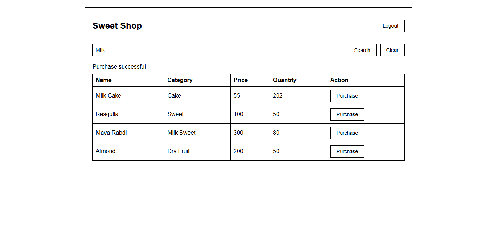

# Sweet Shop Management System


## Features

### Backend (Java21 - Spring Boot, Mysql8)

* User registration
* User login
* JWT authentication
* Admin and normal user roles
* Add sweet (admin)
* Update sweet (admin)
* Delete sweet (admin)
* Restock sweet (admin)
* List all sweets
* Search sweets by name, category, or price
* Purchase sweet (user or admin)

### Frontend (Reactjs)

* Register page
* Login page
* User dashboard (list, search, purchase)
* Admin dashboard (add, update, delete, restock)
* Simple black and white UI

---

## Tech Stack

### Backend

* Java 21
* Spring Boot
* Spring Security
* JWT
* MySQL
* JPA / Hibernate

### Frontend

* React
* React Router
* Fetch API

---

## How to run the backend

1. Install Java 21
2. Install Maven
3. Install MySQL and create a database named `sweetshop`
4. Update the `application.properties` file with your MySQL username and password
5. Go to project backend folder
6. Run:

```
mvn spring-boot:run
```

The backend will start at:

```
http://localhost:8080
```

---

## How to run the frontend

1. Go to the frontend folder
2. Install dependencies:

```
npm install
```

3. Start the frontend:

```
npm run dev
```

Frontend will run on:

```
http://localhost:5173
```

---

## API Endpoints

### Auth

* POST /api/auth/register
* POST /api/auth/login

### Sweets

* POST /api/sweets (admin)
* GET /api/sweets
* GET /api/sweets/search
* PUT /api/sweets/{id} (admin)
* DELETE /api/sweets/{id} (admin)

### Inventory

* POST /api/sweets/{id}/purchase
* POST /api/sweets/{id}/restock (admin)

---

## Screenshots
All screenshots are placed in the `frontend/screenshots/` folder.

### Login Page


### Register Page


### User Dashboard


### Admin Dashboard


### Add/Update Sweet (Admin)


### Purchase Sweet



---

## My AI Usage

I used AI tools while building this project.
The AI helped me write some boilerplate code, fix bugs and speed up the development.
I also used AI to generate some explanations and help with structuring the project.
All final decisions and code adjustments were made manually.

---

## Author
# Kshitij Ratnawat
